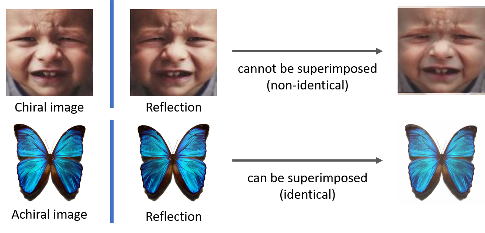

# Facial Chirality

---
## Abstract
As a fundamental vision task, facial expression recognition has made substantial progress recently. However, the recognition performance often degrades largely in real-world scenarios due to the lack of robust facial features. In this paper, we propose a simple but effective facial feature learning method that takes the advantage of **facial chirality** to discover the discriminative features for facial expression recognition. Most previous studies implicitly assume that human faces are symmetric. However, our work reveals that the facial asymmetric effect can be a crucial clue. 
Given a face image and its reflection without additional labels, we decouple the reflection-invariant facial features from the input image pair and then demonstrate that the new features with a standard and lightweight learning model (e.g. ResNet-18) are sufficiently robust to outperform the state-of-the-art methods (e.g. SCN in CVPR 2020 and ESRs in AAAI 2020). Our experiments also show the potential of the new features for other facial vision tasks such as expression image retrieval.

*An illustration of **facial chirality**. The human face is chiral and its horizontal reflection cannot be superimposed to make the same image, while an achiral object can be perfectly overlapped with its horizontal reflection.*

## Readme
1. 
2.
